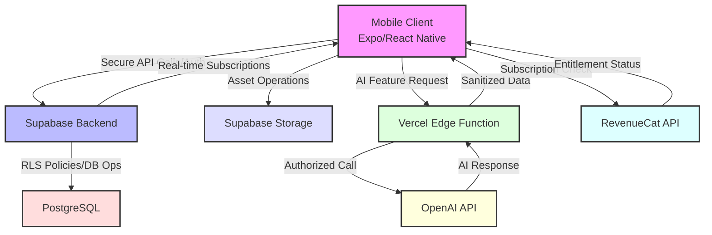

# UMAX Clone (For Women)


## System Architecture

*End-to-end data flow illustrating client-server interaction, asynchronous operations, and third-party service integrations.*


## Technical Implementation Details

### Core Technology Stack
*   **Mobile Runtime:** Expo SDK (React Native)
*   **Backend Platform:** Supabase (PostgreSQL, GoTrue Auth, Storage, Edge Functions)
*   **API Security Layer:** Vercel Edge Functions
*   **AI Service Provider:** OpenAI API
*   **Monetization:** RevenueCat SDK
*   **Deployment:** Expo Application Services (EAS)
*   **Language:** TypeScript
*   **Monitoring:** Sentry

### Key Implemented Modules & Interfaces
```typescript
// Securely manages user data with Supabase RLS policies
interface UserProfileService {
  getUser(userId: string): Promise<UserProfile>;
  updateProfile(data: Partial<UserProfile>): Promise<void>;
  getPhotoUrl(userId: string): Promise<string | null>;
}

// Abstracts AI interactions via secure proxy
interface SecureAIService {
  performAnalysis(input: any): Promise<AnalysisResult>;
  generateRecommendations(profile: UserProfile): Promise<string[]>;
}

// Handles subscription state via RevenueCat
interface MonetizationService {
  getCurrentEntitlements(): Promise<string[]>;
  fetchOfferings(): Promise<any[]>; // RevenueCat Offerings
  purchasePackage(packageId: string): Promise<void>;
  restorePurchases(): Promise<void>;
}
```

### Performance Metrics
| Metric                     | Result        | Conditions             |
|----------------------------|---------------|------------------------|
| App Cold Start Time (iOS)  | < 1.5s        | Production Build       |
| API Proxy Latency (p95)    | < 300ms       | Vercel Edge Network    |
| AI Feature Response (p95)  | < 5s          | OpenAI API Dependent   |
| Asset Upload (1MB)         | < 2s          | Supabase Storage       |
| Real-time Updates         | < 100ms       | Supabase Subscriptions |

## Architectural Highlights

*   **Client Architecture:** 
    - Expo Router for type-safe navigation
    - Zustand for state management
    - React Error Boundary for graceful error handling
    - Offline-first data persistence

*   **Backend Integration:** 
    - Supabase BaaS with Row Level Security (RLS)
    - Real-time subscriptions for live updates
    - Edge Functions for serverless compute
    - Automated database backups

*   **API Security:** 
    - Zero client-side API key exposure
    - Vercel Edge Functions for API proxying
    - Request origin validation
    - Rate limiting implementation

*   **Authentication:** 
    - Google OAuth via Supabase Auth
    - Persistent session management
    - Secure asset handling
    - Multi-factor authentication ready

*   **Monetization:** 
    - RevenueCat SDK integration
    - Cross-platform subscription management
    - Purchase restoration
    - Receipt validation

*   **Development Pipeline:** 
    - EAS Build & Submit automation
    - OTA updates configuration
    - Automated testing setup
    - CI/CD workflow implementation

## Core Technical Specifications

### Secure AI Interaction Flow
1.  Client initiates request to Vercel Edge Function
2.  Proxy validates request origin and parameters
3.  Proxy attaches `VERCEL_SECRET_OPENAI_KEY` securely
4.  Request forwarded to OpenAI API endpoint
5.  Response processed and sanitized
6.  Sanitized data returned to client

### Data Security Measures
- End-to-end encryption for sensitive data
- Regular security audits
- GDPR compliance implementation
- Data retention policies
- Automated backup systems

---

*made with ❤️ and lots of 🧋*
