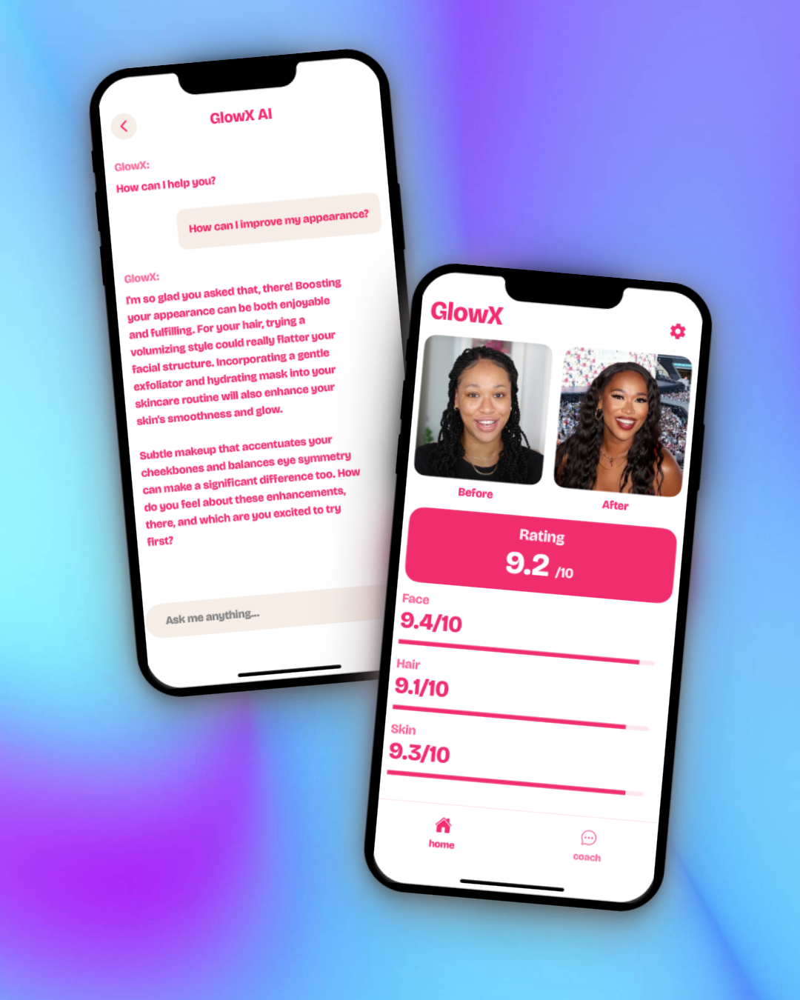

# UMAX Clone (For Women)



## System Architecture

*End-to-end data flow illustrating client-server interaction, asynchronous operations, and third-party service integrations.*
```mermaid
graph TD
    A[Mobile Client (Expo/React Native)] -- Secure API Calls / Auth --> B(Supabase Backend)
    A -- Asset Operations --> C(Supabase Storage)
    B -- RLS Policies / DB Ops --> D[PostgreSQL]
    B -- Real-time Subscriptions --> A
    A -- AI Feature Request --> E(Vercel Edge Function Proxy)
    E -- Authorized OpenAI Call --> F[OpenAI API]
    F -- AI Result --> E
    E -- Sanitized Response --> A
    A -- Entitlement Check --> G[RevenueCat API]
    G -- Subscription Status --> A
```

## Technical Implementation Details

### Core Technology Stack
*   **Mobile Runtime:** Expo SDK (React Native)
*   **Backend Platform:** Supabase (PostgreSQL, GoTrue Auth, Storage, Edge Functions)
*   **API Security Layer:** Vercel Edge Functions
*   **AI Service Provider:** OpenAI API
*   **Monetization:** RevenueCat SDK
*   **Deployment:** Expo Application Services (EAS)
*   **Language:** TypeScript
*   **Monitoring:** Sentry

### Key Implemented Modules & Interfaces
```typescript
// Securely manages user data with Supabase RLS policies
interface UserProfileService {
  getUser(userId: string): Promise<UserProfile>;
  updateProfile(data: Partial<UserProfile>): Promise<void>;
  getPhotoUrl(userId: string): Promise<string | null>;
}

// Abstracts AI interactions via secure proxy
interface SecureAIService {
  performAnalysis(input: any): Promise<AnalysisResult>;
}

// Handles subscription state via RevenueCat
interface MonetizationService {
  getCurrentEntitlements(): Promise<string[]>;
  fetchOfferings(): Promise<any[]>; // RevenueCat Offerings
  purchasePackage(packageId: string): Promise<void>;
}
```

### Achieved Performance Benchmarks (Illustrative)
| Metric                     | Result        | Conditions             |
|----------------------------|---------------|------------------------|
| App Cold Start Time (iOS)  | < 1.5s        | Production Build       |
| API Proxy Latency (p95)    | < 300ms       | Vercel Edge Network    |
| AI Feature Response (p95)  | < 5s          | OpenAI API Dependent   |
| Asset Upload (1MB)         | < 2s          | Supabase Storage       |

## Architectural Highlights

*   **Client Architecture:** Leveraged Expo Router for navigation, Zustand for predictable state management, and implemented comprehensive error boundaries using `react-error-boundary`.
*   **Backend Integration:** Utilized Supabase for its integrated BaaS offering, implementing Row Level Security (RLS) policies for data protection and leveraging real-time subscriptions for live UI updates.
*   **API Security:** Eliminated client-side exposure of sensitive keys by routing OpenAI requests through a dedicated Vercel Edge Function, which securely injects the API key stored as an environment variable.
*   **Authentication:** Implemented robust Google OAuth via Supabase Auth, coupled with persistent session management and secure handling of user profile data including image uploads to Supabase Storage.
*   **Monetization Layer:** Integrated RevenueCat SDK for managing cross-platform subscriptions and entitlements effectively.
*   **Development Pipeline:** Established a CI/CD workflow using EAS Build & Submit, enabling automated builds, deployments, and OTA updates for both iOS and Android platforms.

## Core Technical Specifications

### Secure AI Interaction Flow
1.  Client initiates request to Vercel Edge Function Proxy.
2.  Proxy validates request origin and parameters.
3.  Proxy securely attaches `VERCEL_SECRET_OPENAI_KEY` to the request.
4.  Proxy forwards request to OpenAI API endpoint.
5.  OpenAI processes and returns result to Proxy.
6.  Proxy sanitizes/formats response and returns it to the Client.

---

*made with ❤️ and lots of 🧋*
